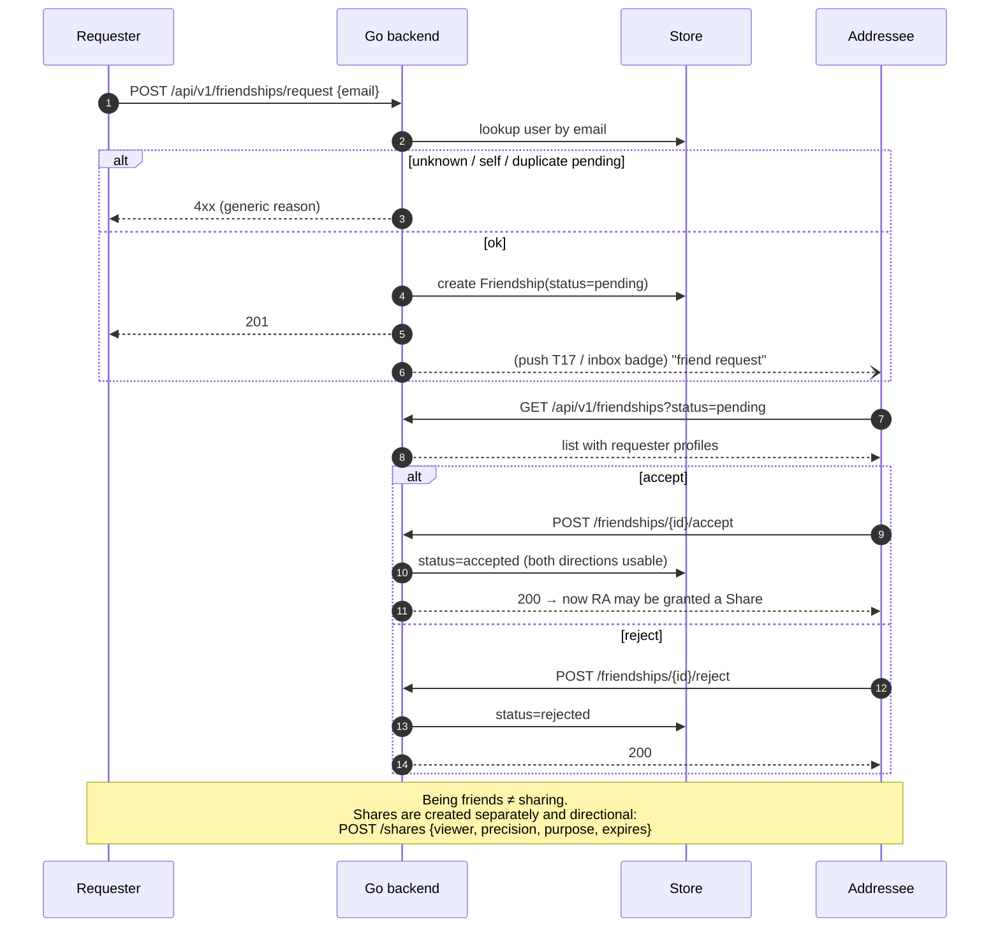

# 07 — Sequence: Friendship lifecycle 📋

```mermaid
sequenceDiagram
    autonumber
    participant RA as Requester
    participant API as Go backend
    participant ST as Store
    participant AD as Addressee

    RA->>API: POST /api/v1/friendships/request {email}
    API->>ST: lookup user by email
    alt unknown / self / duplicate pending
        API-->>RA: 4xx (generic reason)
    else ok
        API->>ST: create Friendship(status=pending)
        API-->>RA: 201
        API--)AD: (push T17 / inbox badge) "friend request"
    end

    AD->>API: GET /api/v1/friendships?status=pending
    API-->>AD: list with requester profiles

    alt accept
        AD->>API: POST /friendships/{id}/accept
        API->>ST: status=accepted (both directions usable)
        API-->>AD: 200 → now RA may be granted a Share
    else reject
        AD->>API: POST /friendships/{id}/reject
        API->>ST: status=rejected
        API-->>AD: 200
    end

    Note over RA,AD: Being friends ≠ sharing.<br/>Shares are created separately and directional:<br/>POST /shares {viewer, precision, purpose, expires}
```
